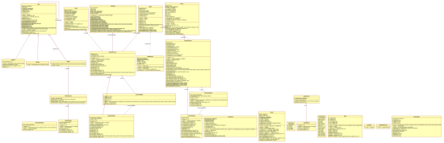
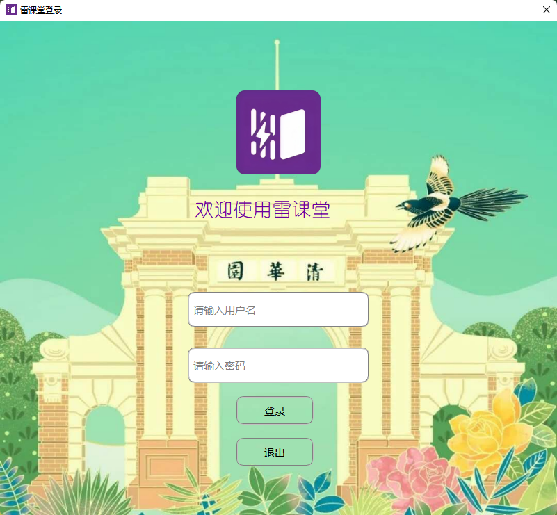
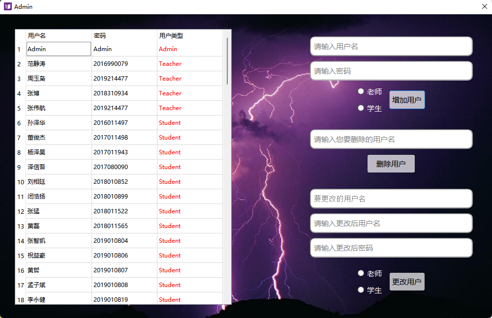
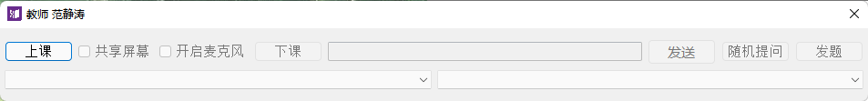
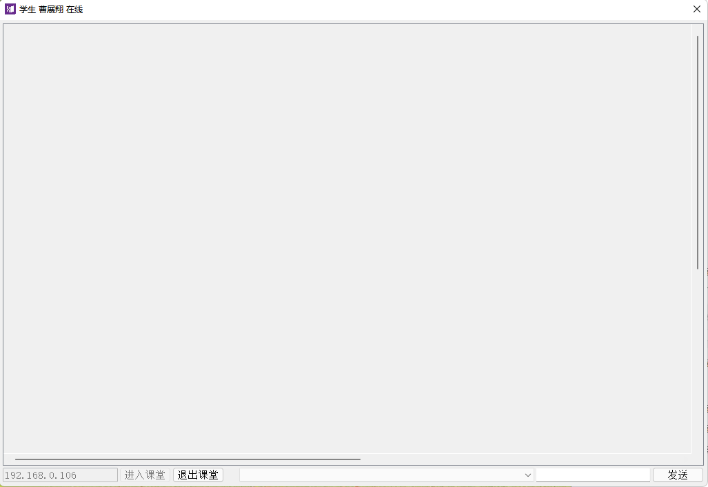
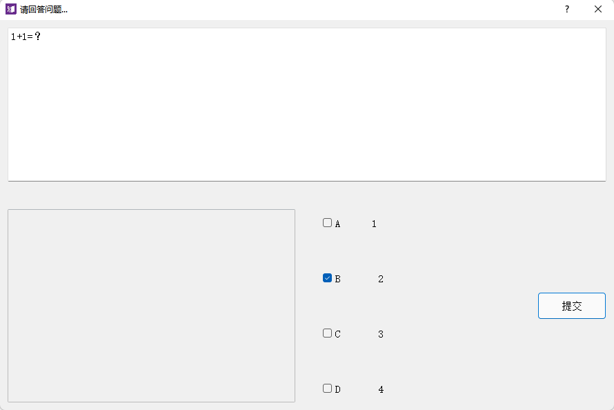
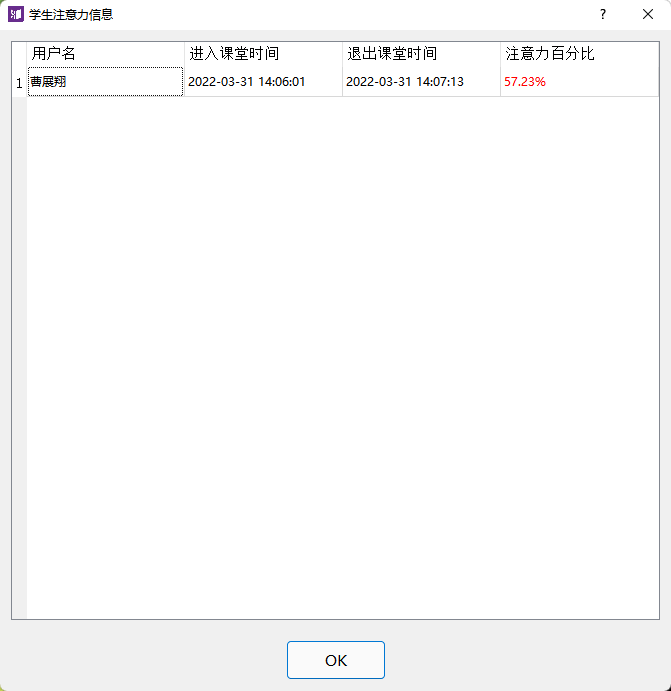

# ThunderClass
雷课堂，此为大一下C++课程大作业，为一款面向课堂教学直播的app

### 功能

+ 用户登录

+ 用户管理（登录Admin用户即可管理）
+ 共享屏幕
+ 语音直播
+ 随机文字提问
+ 在线发题、答题并统计答题情况
+ 学生签到
+ 注意力机制：计算每个学生焦点在当前窗口的时间占比
+ 老师上课、下课
+ 学生进入、退出课堂
+ 聊天框发送显示消息

### 类结构设计

### 界面展示

+ 登陆界面

+ 用户管理界面

+ 老师端直播界面

+ 学生端直播界面

+ 老师端发题界面

+ 学生端答题界面（随机提问时采用问答形式）

+ 老师端结束课堂信息统计界面

### 使用方法

+ 直接运行`/exe`文件夹下的exe即可，支持双开测试
+ 学生端输入老师端电脑的ip即可，如果本机双开测试则为本机ip

